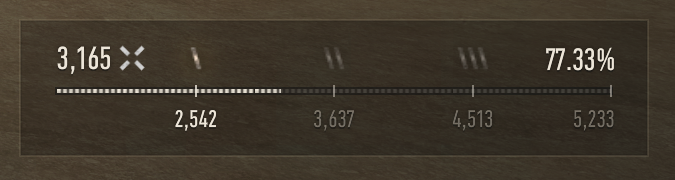
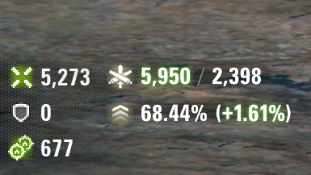

# 14th_ua's MoE Calculator — World of Tanks mod

Track your **Marks of Excellence (MoE)** progress for the vehicle you have selected,
in the Garage and live in battle. The mod reads the game's own MoE data and renders it
with the client's own mark art and interface styling, so it looks like a built-in part
of the interface rather than an add-on.

**English** · [Українська](#14th_uas-moe-calculator--українська)

|  |  |
|:--:|:--:|
|  |  |
| Garage MoE bar | In-battle overlay |

## What it shows

### Garage MoE bar

A percentile bar in the vehicle-parameters panel with milestone ticks at **65% / 85% /
95%** — the 1 / 2 / 3-mark thresholds — each drawn with the client's own mark art. Every
tick is labelled with the combined damage that mark requires, and the bar fills to your
current standing. Above it, a readout shows your current average combined damage and your
current mark percentage for the selected vehicle.

### In-battle overlay

A compact overlay over the HUD with two lines:

- **Live combined damage vs your projected average** — the number is coloured by sign
  (red below your projection, white at it, green above).
- **Your projected MoE percentage** with the signed change versus where you started the
  battle.

The overlay sits over a halftone-dither backdrop that matches WG's own HUD styling,
alongside the minimap and battle markers.

## Compatibility

| Requirement | Detail |
|-------------|--------|
| **Game** | World of Tanks **EU 2.3.1.0** (Wargaming global client). Built and tested against this version. |
| **Required** | **OpenWG GameFace** 1.1.6+ — install it first, or the widget will not appear. From [wgmods.net](https://wgmods.net) or [gitlab.com/openwg/wot.gameface](https://gitlab.com/openwg/wot.gameface). |

## Download & install

**Easiest — the one-click installer (Windows).** Download the latest
**`MoECalculator-Setup-<version>.exe`** from the
[**GitHub Releases**](https://github.com/drizzer14/moe-calculator/releases) page and run
it (close the game first). It finds your World of Tanks folder, installs the mod into
`mods\<version>\`, and adds **OpenWG GameFace** if you don't already have it. On each
run it also checks GitHub and offers to fetch the newest
installer, so a copy you keep around stays current.

**Manual installation.** Grab `com.14th_ua.moe_calculator_<version>.wotmod` from the same
Releases page and follow **[`INSTALL.md`](./INSTALL.md)** — it covers the manual copy,
verifying it works, troubleshooting, and uninstalling.

## Settings

The mod adds a settings panel to the in-game **mod-settings menu**, provided by
**ModsSettingsAPI (MSA)** — the standard settings host bundled with the installer. If MSA
isn't loaded, the mod still runs with both widgets on by default; you just won't see the panel.

The panel has two columns:

**In-Battle Widget** *(on by default)* — shows the live MoE overlay during battle. Uncheck to
hide it and disable the two options below. When it's on, these become available:

- **Show on Alt Key** *(off by default)* — shows the in-battle overlay only while the **Alt**
  key is held. When off, the overlay is shown at all times.
- **Counted Assistance** *(off by default)* — adds a third row to the battle overlay showing
  your counted assistance: the higher of tracking, spotting or stun assist, with an icon for
  whichever is leading.

**In-Garage Widget** *(on by default)* — shows the MoE percentile bar in the Garage, on the
selected vehicle. Uncheck to hide it.

The panel is shown in the client's language.

## Notes

- **Event and special-mode hangars** may not expose the panel the Garage bar attaches to,
  so it won't show there. It returns in the normal Garage.
- **After a game update**, move the `.wotmod` to the new `mods\<version>\` folder. A new
  client version may need a rebuilt mod — check the Releases page.

## MoE data source

The per-tank mark thresholds (the combined damage each mark needs) come from the **official
Wargaming API** — the real damage distribution, so the numbers are authoritative and current.
On entering the garage the mod fetches the selected tank first, then warms your 100
most-recently-played vehicles so switching between them is instant. Results are cached for the
day (revalidated about 24h after Wargaming's own data refresh), and both download channels
(GitHub and WGMods) ship the identical build.

If a request ever fails, the mod falls back to estimating that tank's thresholds from your own
in-game MoE data so the bar still shows numbers rather than blanks.

Your current percentage, average combined damage, and the bar fill always come straight from
the game client and are exact.

## Modpacks & license

Free to use, redistribute, and include in modpacks as long as it stays free and credits the
author (**14th_ua**) with a link back to this repository — see [`LICENSE.md`](./LICENSE.md).
For modpacks, add only the `.wotmod` and list OpenWG GameFace as a required dependency; don't
bundle GameFace yourself.

## Contributing / developers

Building, deploying, testing, and the repo layout are documented in
[`CLAUDE.md`](./CLAUDE.md) (and the dev loop in [`tools/dev/README.md`](./tools/dev/README.md)).

---

# 14th_ua's MoE Calculator — Українська

Відстежуйте прогрес **Знаків Класності** (Marks of Excellence) для обраної техніки — в
Ангарі та наживо в бою. Мод читає власні дані гри про класність і малює їх рідними іконками
та стилем інтерфейсу клієнта, тож він виглядає як вбудована частина інтерфейсу, а не
стороннє доповнення.

[English](#14th_uas-moe-calculator--world-of-tanks-mod) · **Українська**

## Що показує

### Смуга класності в Ангарі

Смуга за перцентилем у панелі параметрів техніки з позначками на **65% / 85% / 95%** —
пороги 1 / 2 / 3 знаків — кожна намальована рідною іконкою знака з клієнта. Кожна позначка
підписана комбінованою шкодою, потрібною для цього знака, а смуга заповнюється до вашого
поточного стану. Над нею — ваша поточна середня комбінована шкода й поточний відсоток знака
для обраної техніки.

### Оверлей у бою

Компактний оверлей над HUD із двома рядками:

- **Поточна комбінована шкода проти прогнозованого середнього** — число забарвлене за знаком
  (червоне нижче прогнозу, біле на рівні, зелене вище).
- **Прогнозований відсоток знака** зі знаком зміни відносно початку бою.

Оверлей розташовано над напівтоновим фоном, що повторює оформлення HUD від WG, поряд із
мінімапою та бойовими маркерами.

## Сумісність

| Вимога | Деталі |
|--------|--------|
| **Гра** | World of Tanks **EU 2.3.1.0** (глобальний клієнт Wargaming). Зібрано й перевірено для цієї версії. |
| **Обов'язково** | **OpenWG GameFace** 1.1.6+ — встановіть першим, інакше віджет не з'явиться. З [wgmods.net](https://wgmods.net) або [gitlab.com/openwg/wot.gameface](https://gitlab.com/openwg/wot.gameface). |

## Завантаження та встановлення

**Найпростіше — інсталятор в один клік (Windows).** Завантажте найновіший
**`MoECalculator-Setup-<version>.exe`** зі сторінки
[**релізів на GitHub**](https://github.com/drizzer14/moe-calculator/releases) і запустіть
(спершу закрийте гру). Він знаходить папку World of Tanks, встановлює мод у `mods\<version>\`
і додає **OpenWG GameFace**, якщо його ще немає. Під час кожного запуску
він також перевіряє GitHub і пропонує завантажити найновіший інсталятор, тож збережена копія
залишається актуальною.

**Встановлення вручну.** Візьміть `com.14th_ua.moe_calculator_<version>.wotmod` з тієї ж
сторінки релізів і дотримуйтесь **[`INSTALL.md`](./INSTALL.md)** — там описано ручне
копіювання, перевірку роботи, усунення несправностей і видалення.

## Налаштування

Мод додає панель до внутрішньоігрового **меню налаштувань модів**, яке надає
**ModsSettingsAPI (MSA)** — стандартний застосунок налаштувань, що йде разом з інсталятором.
Якщо MSA не завантажено, мод усе одно працює з увімкненими за замовчуванням віджетами — просто
не буде панелі.

Панель складається з двох стовпців:

**Віджет у бою** *(увімкнено за замовчуванням)* — показує накладання класності наживо в бою.
Зніміть позначку, щоб сховати його та вимкнути два параметри нижче. Коли він увімкнений, стають
доступними:

- **Показувати по клавіші Alt** *(вимкнено за замовчуванням)* — показує бойове накладання лише
  поки утримується клавіша **Alt**. Коли вимкнено, накладання показується постійно.
- **Зарахована допомога** *(вимкнено за замовчуванням)* — додає третій рядок до накладання в
  бою: показує зараховану допомогу, більше з допомоги гусеницями, засвітом чи оглушенням, з
  піктограмою відповідного типу.

**Віджет в ангарі** *(увімкнено за замовчуванням)* — показує смугу процентиля класності в
Ангарі на вибраній машині. Зніміть позначку, щоб сховати.

Панель показується мовою клієнта.

## Примітки

- **Подієві та спеціальні ангари** можуть не надавати панель, до якої кріпиться смуга в
  Ангарі, тож там вона не з'явиться. У звичайному Ангарі вона повертається.
- **Після оновлення гри** перемістіть `.wotmod` у нову папку `mods\<версія>\`. Нова версія
  клієнта може потребувати перезібраного мода — перевіряйте сторінку релізів.

## Джерело даних класності

Пороги знаків для кожної техніки (комбінована шкода, потрібна для знака) беруться з
**офіційного API Wargaming** — це реальний розподіл шкоди, тож числа автентичні й актуальні.
При вході в ангар мод спершу завантажує обрану техніку, а потім прогріває 100 ваших
найнедавніше зіграних машин, щоб перемикання між ними було миттєвим. Результати кешуються на
день (перевіряються приблизно за 24 год після оновлення даних Wargaming), і обидва канали
завантаження (GitHub і WGMods) постачають ідентичну збірку.

Якщо запит колись не вдасться, мод оцінює пороги цієї техніки з ваших власних ігрових даних
класності, тож смуга все одно показує числа, а не порожнечу.

Ваш поточний відсоток, середня комбінована шкода й заповнення смуги завжди беруться
безпосередньо з клієнта гри й точні.

## Модпаки та ліцензія

Вільно використовувати, поширювати та включати в модпаки, доки це залишається безкоштовним і
зазначає автора (**14th_ua**) з посиланням на цей репозиторій — див. [`LICENSE.md`](./LICENSE.md).
Для модпаків додавайте лише `.wotmod` і вкажіть OpenWG GameFace як обов'язкову залежність; не
вкладайте GameFace самі.

## Розробка

Збірка, розгортання, тести та структура репозиторію описані в [`CLAUDE.md`](./CLAUDE.md) (а
цикл розробки — у [`tools/dev/README.md`](./tools/dev/README.md)).
